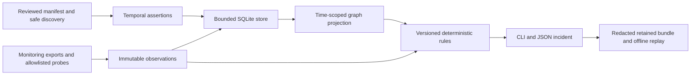

# Architecture

The shipped product is a CLI and bounded read-only worker layer over existing monitoring. Core contracts contain no database-brand or operating-system branching. Database and Linux logic reside in registered adapters.

The manifest owns intent and authorised probe destinations. Discovery uses bounded `/proc` process identity (host scope, boot and process start ticks), listener inventory and systemd service inventory. Names/ports do not identify technologies. Nginx extraction is a safe structural subset: only proxy/server destinations are emitted. Includes, variables, routing precedence and generated configuration require explicit contracts or a mature collector.

SQLite retains records and canonical content hashes. Entity records have a stable logical identity and immutable revision IDs, while process identities resist PID reuse. Assertions carry source, validity, view and unknown dependency conditions. INTENDED/DISCOVERED/OBSERVED coexist; dormant declarations remain unobserved, never assumed absent. Graph revision hashes resolve to retained entities/assertions. Stored OR/quorum/synchrony fields preserve known semantics but automatic propagation is deliberately absent. No contact edge becomes causal evidence.

A validated manifest runs up to 32 supervised workers sequentially. Each worker has one operation, an absolute deadline, capped stdout/stderr, restricted environment and process-group termination. Plugin failure becomes collection UNKNOWN; an executor-observed failure becomes a scoped target FAIL. Direct probes fill the offline or representative-operation gap; bulk telemetry remains upstream.

Rules are versioned JSON packages. A fresh direct measurement supports its exact failing predicate strongly. Imported measurements receive moderate support. Required-evidence gaps or scoped contradictions make a finding inconclusive. Strong means support for the measured boundary, not a probability or a cause. Derived measurements share dependence groups; collector independence is not presumed. Event time takes precedence over out-of-order receipt, and co-temporal conflicting states survive.

Reports resolve claims to evidence IDs and versions, retain successful checks with their scope, list uncertainty and registered read-only next checks. Next checks are recommendations, not executed recursive plans. Incident bundles embed safe evidence, topology records, original rule packages, report time and hashes; replay makes no network, DB, shell or LLM call.

Extension seams: extra registered adapters, original declarative rules, telemetry exports, build-matched source evidence and structured incident memory. A closed citation-selector stub demonstrates deterministic fallback when explanation fails. There is no live LLM integration, remediation, coordinator, eBPF capture or continuous telemetry engine.
