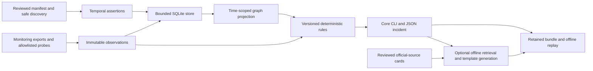

# Architecture

Phoebe 0.3.0 is a local CLI and bounded read-only worker layer over existing monitoring. Evidence contracts remain technology neutral; registered collectors implement network, host, systemd, database, Nginx, Docker and static Python venv operations.

The manifest owns intent and authorized destinations. Discovery records bounded process identity, listeners and systemd inventory without automatically probing them. Names, ports and headers do not identify technologies. Nginx extraction captures a structural destination subset; includes, variables, route precedence and generated configuration remain unmeasured.

SQLite retains validated records and canonical hashes. Logical entity identity and immutable revisions are separate from instance identity. Assertions preserve source, validity, view and unknown conditions; INTENDED/DISCOVERED/OBSERVED coexist. Dormant intent is unobserved, not verified absence. Temporal graph revisions resolve to retained records. Known OR/quorum/synchrony fields are stored without an automatic propagation solver. Contact edges establish no causality.

Up to 32 supervised workers execute sequentially, each with one registered operation, an absolute deadline, capped stdout/stderr, restricted environment and process-group termination. Executor failure becomes collection UNKNOWN; a measured target contract breach can become FAIL. Docker/venv workers revalidate local contracts, target/route/vantage and scope before access. Docker uses fixed GETs on an approved Unix socket and immutable container IDs; venv uses bounded static metadata reads without target-controlled execution. Bulk telemetry stays upstream.

Versioned JSON rules derive ordinal support: fresh direct evidence can strongly support its exact failing boundary; imported evidence is moderate; contradictory or missing prerequisites are inconclusive. Support does not imply probability or an initiating cause. Measurements retain dependence groups. Current engines use event-time precedence and preserve co-temporal conflicts; a newer UNKNOWN blocks older PASS within the same full scope and dependence group. Reason-specific rules select matching support rather than unrelated same-scope failures. The 0.1.0 evaluator remains available for legacy replay.

Reports retain evidence IDs, scope, graph revision, versions, successes, unknowns and registered read-only recommendations. Next checks are not an autonomous recursive investigator. Enriched guidance uses 45 original cards from 34 fixed official sources, BM25-2 retrieval and template-1 generation. It is a separate context: it never changes findings, confidence, runtime status or core coverage. Source auditing is a separate supervised HTTPS operation, not continuous indexing or automatic prose updates.

Core bundles use schema 1; enriched bundles use schema 2 and include the reviewed corpus/context. Record and store versions remain 1. Replay checks hashes and reproduces the report from embedded evidence/rules with the recorded engine, then guidance from embedded cards with the recorded retrieval version. It makes no network, database, shell or model call and supports old 0.1.0/0.2.0 incidents and bm25-1 contexts.

Extension seams include registered collectors, declarative rules, snapshot adapters, build-matched source evidence and structured incident memory. A citation-selector stub demonstrates fallback behavior separately from the shipped offline guidance. Live model explanation, remediation, coordination, eBPF capture, continuous telemetry and full source indexing remain unimplemented. See [schema](schema-reference.md), [knowledge](knowledge.md), [budgets](budgets.md) and [coverage](coverage.md).
