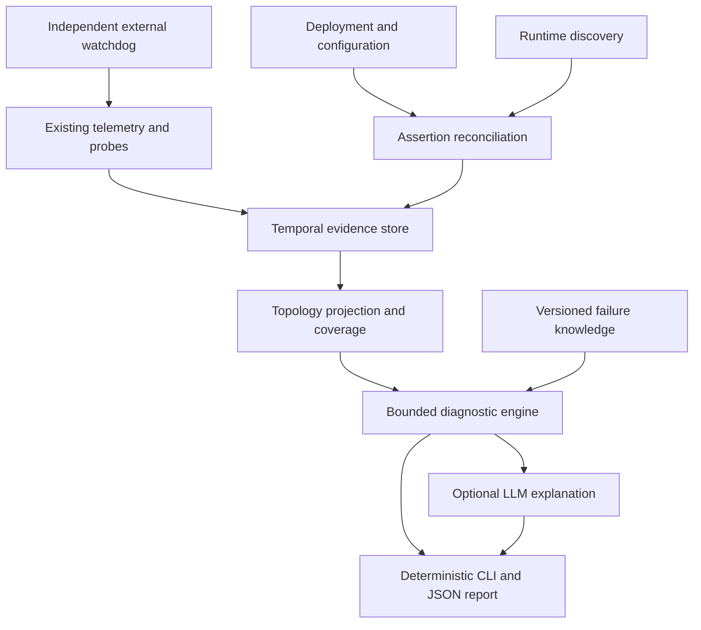

# Evidence-based supportability for opaque software

Research and architecture review — 1 October 2026

## Recommendation

Build a small, portable diagnostic layer over existing monitoring, rather than a new observability platform. Its central abstraction should be a **temporal operational evidence model**: a typed graph projection of versioned assertions and observations, accompanied by coverage information, diagnostic rules and replayable incident records.

Keep “Support Model” as a working label. The concept overlaps architecture recovery, runtime models, CMDB reconciliation, autonomic computing and operational knowledge graphs. Calling it a digital twin adds little unless it eventually includes a validated behavioural simulator. A topology graph alone is not a causal model.

The proposed separation of deterministic evidence from AI explanation is sound, but already exists in related products. Coroot is the closest counterexample to a novelty claim: it documents dependency traversal and machine-learning analysis followed by LLM explanation of selected findings [S01–S02]. Dynatrace also documents topology-aware fault-tree diagnosis [S03]. These approaches must be compared with a new build before investing heavily.

The plausible project opportunity is the combination of portable evidence contracts, explicit intended/discovered/observed reconciliation, trustworthy boundary localisation, inspectable failure knowledge and local operation. That combination is a hypothesis about usefulness, not a demonstrated market gap or patent claim.

## Research scope and limits

Primary documentation, upstream repositories, standards and author publications were searched across every requested category. Critical architecture claims were checked against full accessible documentation. Some documentation was available only through indexed excerpts: direct retrieval of the IBM RCA page was blocked; one Datadog page returned an unsupported Markdown content type. The report distinguishes documented product capabilities from architectural inference. No vendor was installed or benchmarked, and no production incident was investigated.

This is broad research, not a claim to have exhausted every product, publication or unpublished industrial system. Current names, availability, regional restrictions, licences, API behaviour and component maturity must be verified again when implementation begins. Vendor success percentages are not transferable performance guarantees. Recent preprints are research leads, not established operational results. Direct access to the linked MAPE-K paper was also blocked; its indexed description was used only to identify adjacent work, not to validate results.

## 1. Challenge the premise

1. **The problem is not unique to AI.** Outsourced systems, acquired applications, legacy software and large distributed estates already exceed any individual's understanding. AI increases the rate at which operational understanding can fall behind changes. Lines of code are a weak measure of either delivered value or support difficulty.
2. **Supportability does not require complete understanding.** It requires useful observations, a bounded scope, a way to discriminate competing explanations and a responsible escalation path.
3. **Automatic discovery cannot recover all intent.** It cannot know that a tax calculation, permission decision or payment amount is wrong without a specification or oracle. Some application contracts must be supplied or generated and reviewed against authoritative requirements.
4. **Instrumentation and deployed software can lie.** A health endpoint can always return 200; telemetry can be sampled, stale, incomplete or emitted by faulty code. Independent black-box checks remain essential [S04].
5. **Boundary localisation is different from root cause.** “Application cannot complete a database operation” may be justified while “database pool exhaustion caused it” remains unproven.
6. **Operational diagnosis does not establish software safety.** This architecture reduces incident investigation effort; it cannot validate unreviewed code, security, data correctness or deployment readiness by itself.

Revised objective: **give an unfamiliar engineer a defensible starting point and the next safe discriminating check, even when internal application semantics remain unknown.**

## 2. Existing art and useful lessons

The following are research findings about documented capabilities. The final column is an architectural judgment, not a product benchmark.

| Category / technology | Documented contribution | Lesson for this project |
|---|---|---|
| OpenTelemetry | Signals, OTLP, semantic conventions, resource identity and Collector pipelines [S05–S08] | Reuse the telemetry ecosystem; add diagnostic meaning rather than another telemetry transport. |
| Prometheus | Exporters, alert evaluation, query functions and black-box integrations [S09–S11] | Reuse time-series queries and probes; preserve scrape failures as evidence about collection. |
| Grafana / Alloy | Collection pipelines and trace-derived service graph metrics [S12] | Compose collectors and backends; a graph depends on usable instrumentation. |
| Loki | Log storage with specific cardinality constraints [S13] | Keep incident IDs and arbitrary text out of unbounded label sets. |
| Tempo | Service graphs derived from spans [S14] | Missing spans and incomplete pairing create incomplete topology. |
| Jaeger | Trace investigation and sampling [S15] | A recorded path establishes occurrence; absence of a sampled path does not establish nonexistence. |
| Elastic Observability / AI Assistant | Telemetry investigation, knowledge-assisted explanations [S16] | An existing backend can provide an investigation adapter. |
| Elastic Universal Profiling | Whole-system continuous profiling [S17] | Profiling answers where work is spent, not whether business results are correct. |
| Datadog | APM plus Bits Investigation's iterative hypotheses and telemetry collection; separate remediation capabilities [S18–S19] | Evidence-backed investigation is already a product category. |
| Dynatrace | Topology, events, fault trees, code-level and impact analysis [S03] | Separate affected services from initiating contributors. |
| New Relic / Autopilot | Trace/log/resource investigation with documented coverage limits [S20] | Metadata and telemetry coverage remain prerequisites. |
| Splunk ITSI | Service KPIs, dependency views and event aggregation [S21] | Mature service-health composition and event suppression deserve reuse. |
| Honeycomb | High-dimensional event investigation and BubbleUp outlier comparison [S22] | Show discriminating evidence; anomaly differences are not automatically causes. |
| Coroot | eBPF discovery, database metrics, topology-based diagnosis and AI explanation [S01–S02] | Mandatory build-versus-integrate baseline. |
| Pixie | Kubernetes runtime protocol telemetry through eBPF, including supported TLS library probes [S23–S24] | Zero source changes do not mean universal protocol or kernel coverage. |
| Cilium / Hubble | Flow visibility and dependency maps; L7 visibility has configuration requirements [S25–S26] | Network relationships and application causal dependencies are different. |
| Sourcegraph / SCIP | Symbols, definitions, references and repository navigation [S27] | Use only when the narrowed incident needs source drill-down. |
| AppMap | Recorded execution paths and navigable runtime diagrams [S28] | Useful developer/CI evidence; recorded workloads cover only exercised paths. |
| CAST Imaging | Extracted architecture, dependency and data-access views [S29] | Static architecture can enrich declared possibilities; evaluate cost and language coverage. |
| Joern / code property graphs | AST, control-flow and data-flow representations [S30] | Valuable deep analysis substrate, excessive as an MVP prerequisite. |
| Backstage | Components, APIs, resources and ownership metadata [S31] | Import catalogue identity/ownership; do not mistake ownership metadata for live health. |
| OpsLevel | Discovery and dependency catalogue features [S32] | Catalogue integrations can provide declared metadata. |
| Cortex | Declared dependencies and some integration-derived discovery [S33] | Keep provenance when importing relationships. |
| Port | Entities, blueprints and relations [S34] | Configurable catalogue schemas can map into a small support ontology. |
| Kubernetes probes | Distinct startup, liveness and readiness semantics [S35] | Never restart healthy processes solely because a remote dependency is down. |
| Blackbox Exporter | DNS, TCP, HTTP, TLS and gRPC probing [S10] | Reuse bounded probes with explicit vantage and credentials. |
| gRPC health protocol | Standard health-check service [S36] | Serving status is useful but is not an end-to-end business transaction. |
| Checkmk | Separation of collection, parsing, discovery, checks and inventory [S37] | Adopt this separation instead of one enormous plugin interface. |
| Zabbix | Low-level discovery and generated monitoring items [S38] | Discover checks from facts and templates; manage disappeared resources. |
| Nagios / Monitoring Plugins | Stable status codes, performance data and UNKNOWN handling [S39] | Adapt mature probes and preserve uncertainty. |
| Icinga | Monitoring Plugins integration and dependencies [S40] | Distinguish suppression of duplicate notifications from causal proof. |
| Netdata | Edge collection and statistical anomaly detection [S41] | Local statistical analysis is feasible without an LLM. |
| Sensu | Scheduled checks, execution timeouts and event handling [S42] | Use bounded work and separate checking from handling. |
| Monit | Local service and protocol checks with actions [S43] | A simple local loop can remain useful during central outages. |
| IBM Instana | Dynamic topology/trace-based probable component attribution [S44] | Root-cause output is still an estimate requiring verification. |
| BigPanda | Alert correlation and suspected change attribution [S45] | Change evidence should be a first-class input. |
| PagerDuty AIOps | Event orchestration, alert intelligence and runbook integration [S46] | Compose incident lifecycle tooling rather than rebuilding on-call workflows. |
| Moogsoft | Acquired by Dell; documentation/product lineage requires rechecking [S47] | Do not assume an old product name identifies a current independent offering. |
| Rundeck | Existing runbook execution/orchestration [S48] | Later remediation can integrate a mature executor. |

Commercial coverage varies by edition, connector, permission and deployment. Broad claims of autonomous remediation do not demonstrate that arbitrary applications can be safely repaired without constraints. Datadog's current documentation uses **Bits Investigation**; Dynatrace uses **Dynatrace Intelligence** while retaining Davis fields; New Relic documents **Autopilot**, formerly SRE Agent [S18–S20].

### Standards and nearby abstractions

| Existing abstraction | Reuse | Boundary |
|---|---|---|
| OTel resource/service conventions | Attribute naming and interoperable telemetry identity [S05–S07] | Semantic convention stability varies; pin versions. |
| OTel entity data model | Repeatable identities and entity/telemetry associations [S08] | Relationship modelling is explicitly evolving; do not require universal implementation support. |
| TOSCA | Types, relationships and lifecycle modelling [S49] | Import useful concepts; requiring full orchestration compliance would expand the MVP. |
| DMTF CIM | Managed infrastructure concepts [S50] | A complete enterprise model is too large for the first slice. |
| W3C PROV | Entity/activity/agent provenance and derivation [S51] | JSON provenance fields can implement the idea without an RDF runtime. |
| CMDB / software catalogue | Identity, ownership, declared relationships | A snapshot cannot establish runtime validity. |
| Operational knowledge graph | Typed relations plus meaning | Knowledge graphs do not inherently establish causality. |
| Digital twin | Synchronisation of a model with a running system [S52] | Simulation fidelity and behavioural validation are additional requirements. |
| MAPE-K / autonomic computing | Monitor, analyse, plan and execute around knowledge [S53] | Keep execution disabled until separately authorised. |
| OpenC2 | Separation and structure of action commands [S54] | Cyber-defence command language, not a general failure-diagnosis standard. |

## 3. Research literature: algorithms worth exploiting

| Research | Useful mechanism | Limitation / use |
|---|---|---|
| MicroRCA [S55] | Graph-based ranking using application response times and infrastructure metrics | Compare as a baseline; correlation ranking does not prove cause. |
| Sage [S56] | Dependency-aware unsupervised performance models | Consider later for latency diagnosis; reported results are benchmark-specific. |
| RCACopilot [S57] | Incident-type-specific evidence collection followed by classification/explanation | Strong precedent for bounded diagnostic handlers; depends on curated handlers. |
| Drain [S58] | Online log-template extraction | Normalize repeated messages without handing all raw logs to an LLM. Preserve examples and parser errors. |
| RCA survey [S59] | Metric, trace, log and multimodal approaches | Study graph propagation, Bayesian models and causal methods; no method wins all contexts. |
| RCAEval [S60] | Reproducible datasets and classical RCA baselines | External comparison complements stack-specific fault injection. Dataset leakage must be prevented. |
| AIOpsLab [S61] | Workload generation, fault injection, telemetry and agent evaluation | Reuse test concepts; do not import its entire cloud stack into a VM MVP. |
| Static architecture recovery comparison [S62] | Comparison of extraction tools | Useful for selecting later adapters; language/framework coverage remains material. |
| Knowledge graphs in digital twins [S52] | Literature on model integration and maintainability | Adjacent work, largely not proof of software-diagnosis efficacy. |
| Recent causal/LLM RCA preprints [S63] | Confounding, multimodal evaluation and evolving causal graphs | Promising research leads; verify methods and reproduce results before adoption. |

Algorithm recommendations are design judgments: begin with deterministic predicates, temporal windows, typed topology traversal, contradiction checks and multiple candidate boundaries. Add robust slopes/EWMA/change-point methods for resource trends. Bayesian diagnosis or calibrated classifiers require training data and explicit assumptions. Structural causal models and counterfactual methods may add value later, but latent shared infrastructure, retries and feedback loops make naive DAG learning unreliable.

For indistinguishable hypotheses, choose a safe next observation that best separates them. Expected information gain is a principled future option when probabilities are calibrated; a documented deterministic priority table is sufficient initially.

## 4. What is mature, fragmented or plausibly missing?

| Classification | Finding |
|---|---|
| Existing and mature | Metrics/logs/traces, protocol checks, exporters, agent collection, plugin timeouts, service catalogues, runbooks and infrastructure discovery. |
| Existing but fragmented | Deployment/runtime reconciliation, evidence provenance across tools, technology-specific diagnostics and incident memory. |
| Existing but ecosystem-dependent | Rich automatic topology, code-level diagnosis and agentic investigations tied to particular data platforms. Vendor independence and feature openness vary. |
| Partially solved | Causal attribution under sparse data, stale graphs, concurrent failures, misleading health checks and novel software behaviour. |
| Apparently missing in this review | A widely adopted, lightweight interchange contract combining temporal topology assertions, probe vantage/coverage, diagnostic evidence and portable failure packages. This is a qualified observation, not proof of absence. |

No useful universal failure-mode schema was established by this review. Existing plugin checks, database documentation, alert rules and runbooks can seed one. Community alert libraries are useful author-maintained sources, not authoritative defaults; audit semantics, metrics, units, versions and licences [S64].

## 5. Serious architecture alternatives

Scores are qualitative engineering judgments under the reference workload: a small Linux service today, local/offline diagnosis and eventual heterogeneous scale. They are not measured vendor performance. A score of 5 is favourable: for COST it means low cost, and for LOCK it means vendor independence.

Scale: 0 absent; 1 poor; 2 constrained; 3 adequate; 4 strong; 5 very strong. All dimensions are equally visible; no scalar winner is computed. Differences of one point are weak judgments, not statistically significant results.

PORT portability; AUTO discovery; DEPTH diagnosis depth; EXT extensibility; CLAR clarity; AI machine reasoning; DET evidence quality; SEC least privilege; OPS simplicity; FAIL monitoring failure tolerance; SCALE scalability; LOCAL offline; COST low operational cost; LOCK independence.

### Initial vectors, before failure/operability review

| Architecture | PORT | AUTO | DEPTH | EXT | CLAR | AI | DET | SEC | OPS | FAIL | SCALE | LOCAL | COST | LOCK |
|---|---:|---:|---:|---:|---:|---:|---:|---:|---:|---:|---:|---:|---:|---:|
| A Monitoring + AI | 4 | 3 | 3 | 4 | 3 | 3 | 4 | 4 | 4 | 4 | 4 | 4 | 4 | 4 |
| B OTel-centric | 4 | 3 | 3 | 5 | 3 | 4 | 4 | 4 | 3 | 4 | 5 | 4 | 4 | 5 |
| C eBPF-first | 2 | 5 | 4 | 3 | 3 | 4 | 4 | 2 | 3 | 3 | 4 | 4 | 3 | 4 |
| D Code-first | 4 | 3 | 5 | 3 | 3 | 4 | 3 | 4 | 2 | 2 | 3 | 4 | 2 | 4 |
| E Catalogue-first | 4 | 2 | 2 | 4 | 4 | 4 | 2 | 5 | 4 | 3 | 4 | 3 | 3 | 4 |
| F Graph/twin-first | 4 | 3 | 4 | 5 | 4 | 5 | 3 | 4 | 2 | 3 | 4 | 4 | 2 | 5 |
| G Hybrid | 5 | 4 | 5 | 5 | 5 | 5 | 5 | 4 | 2 | 4 | 5 | 5 | 3 | 5 |

### Revised vectors after constraints and simplification

| Architecture | PORT | AUTO | DEPTH | EXT | CLAR | AI | DET | SEC | OPS | FAIL | SCALE | LOCAL | COST | LOCK |
|---|---:|---:|---:|---:|---:|---:|---:|---:|---:|---:|---:|---:|---:|---:|
| A Monitoring + AI | 4 | 3 | 3 | 4 | 3 | 3 | 4 | 4 | 4 | 4 | 4 | 4 | 4 | 4 |
| B OTel-centric | 4 | 3 | 3 | 5 | 3 | 4 | 4 | 4 | 3 | 4 | 5 | 4 | 4 | 5 |
| C eBPF-first | 2 | 4 | 3 | 3 | 3 | 4 | 4 | 2 | 2 | 3 | 4 | 4 | 3 | 4 |
| D Code-first | 4 | 2 | 3 | 3 | 2 | 4 | 3 | 4 | 2 | 2 | 3 | 4 | 2 | 4 |
| E Catalogue-first | 4 | 2 | 2 | 4 | 4 | 4 | 2 | 5 | 4 | 3 | 4 | 3 | 3 | 4 |
| F Graph/twin-first | 4 | 2 | 3 | 5 | 3 | 5 | 3 | 4 | 2 | 3 | 3 | 4 | 2 | 5 |
| G Constrained hybrid | 4 | 4 | 4 | 5 | 4 | 5 | 4 | 4 | 3 | 4 | 4 | 5 | 4 | 5 |

G loses optimistic depth/evidence/scale claims and gains simplicity through a single local deployment and optional enhancements. C loses universal discovery because protocol and privilege limits matter. D cannot infer live execution and configuration accurately from source alone. F cannot conjure missing evidence merely by storing it in a graph. A may be the best business choice where Checkmk or another mature platform already meets requirements. B is the preferred telemetry substrate, but not a complete diagnosis architecture.

### Documented review passes

These were architecture desk reviews, not repeated independent experiments. The record lists findings and resulting changes rather than private reasoning.

| Pass | Attack / review | Change or outcome |
|---:|---|---|
| 1 | Existing art | Coroot and commercial RCA undermine novelty; add build/integrate gate. |
| 2 | Gaps | Focus on portable evidence, reconciliation and operator output. |
| 3 | Alternatives | Compare A–G without assuming the hybrid wins. |
| 4 | Failure | Introduce stale/unknown states, multiple candidates and common-cause failures. |
| 5 | Operability | Separate plugin capabilities; remove mandatory graph DB and central services. |
| 6 | Unknown source | Require topology/probe diagnosis without indexing; admit semantic blind spots. |
| 7 | Determinism | Remove LLM calculation, confidence assignment and unsupervised shell execution. |
| 8 | Human support | Evidence IDs, probe vantage, bounded next check and escalation packet. |
| 9 | Scale | Logical/instance identity, bounded graph neighbourhoods, async/quorum semantics. |
| 10 | Simplification | One local service, embedded storage candidate, mature telemetry reuse. |
| 11 | Re-score | Apply revised vectors above; abandon initial 5-point optimism. |
| 12 | Combined replay | Pool exhaustion example remains ambiguous; keep database-operation boundary and competing candidates. |
| 13 | Closure review A | No additional material architecture or high-impact failure category; revised vectors unchanged. |
| 14 | Closure review B | No additional material simplification; revised vectors unchanged. |

Convergence at pass 14 is bounded by this research and desk-review scope. The final two closure reviews produced no score changes, new architecture or high-impact failure category. This is sufficient to freeze a research baseline, not to claim production readiness. Fault injection or measurements may reopen decisions immediately.

## 6. Recommended model and data flow



The graph is a projection; the underlying record is versioned assertions plus observations. Keep raw bulk telemetry in existing backends. Store bounded evidence excerpts or references with hashes, source identity and retention information so an incident remains explainable after the live graph changes.

Use a hybrid logical model: relational/document-friendly entities and events, typed graph edges for traversal, and versioned diagnostic packages. Event sourcing ideas improve provenance and replay, but a distributed event-sourcing platform is unnecessary. SQLite is a reasonable MVP candidate, subject to a short decision record; a graph database is not required by the ontology.

### Three views, no automatic overriding

| View | Sources | Meaning |
|---|---|---|
| Intended | Manifests, IaC, systemd units, Nginx upstreams, safe config metadata, explicit functional contracts | Claims about desired components and possible relationships. |
| Discovered | Processes, service states, sockets, containers and inventory | Claims about present instances and observed configuration. |
| Observed | Traces, network flows, logs and actual dependency operations | Claims about exercised relationships during a time window. |

“Observed” does not mean complete; “intended” does not mean authoritative for actual behaviour. Never overwrite contradictory source assertions. Emit drift findings with coverage caveats: undeclared dependency, expected instance absent, declared relationship unobserved, version mismatch, identity ambiguity. An unobserved relationship is not an absent relationship without a relevant workload and adequate coverage.

### Compact conceptual schema

| Record | Required core |
|---|---|
| Entity | schema version, scope/tenant, stable logical ID, instance ID where relevant, kind, technology/version, attributes, provenance |
| Relationship assertion | source and target IDs, relation type, view, valid interval, collected time, source/method, evidence IDs, condition, criticality, synchrony, route, quorum/fallback semantics if known |
| Probe definition | target, vantage/network namespace, credential reference, operation, timeout, frequency, expected predicate, cost class, side-effect class |
| Observation | immutable ID, subject, event time, receipt time, freshness window, value/units, result, collector health, coverage, uncertainty, correlation/dependence group, provenance, redaction status |
| Finding | type, boundary/path, supporting and contradictory IDs, unknowns, rule/model version, explanation, ordinal support, next checks |
| Incident | impacted contract, interval, graph revision, evidence snapshot, candidate findings, changes, operator resolution and final cause status |
| Failure package | applicability, required evidence, predicates, contradictions, predicted effects, diagnostic actions, source/licence, tests, version |
| Action descriptor | read/write class, required privileges, preconditions, resource/target allowlist, deadline, expected result, approval requirement, rollback/compensation |

Application, component, process, service, endpoint, host, storage and network boundary are entity kinds. Dependency is a typed relationship, not necessarily a separate object. Probe, metric/log/trace source, failure mode and remediation are definitions or references. Observation, inference and hypothesis remain distinct records. Avoid twenty subclasses with identical fields.

Relationships include RUNS_ON, LISTENS_ON, PROXIES_TO, DEPENDS_ON, CONNECTS_TO, STORES_IN, EMITS and MONITORED_BY. FAILURE_PROPAGATES_TO must be a validated mechanism or a labelled hypothesis; it must never be fabricated from CONNECTS_TO alone. Logical service identity and ephemeral process/container identity remain separate. Process identity must resist PID reuse; host/scope and start time matter.

## 7. Layered diagnosis without a false linear hierarchy

Host → process → port → protocol → dependency operation → readiness → transaction → user path is a useful check ordering, not a universal tree. UNIX sockets have no TCP port; managed databases have no visible local process; healthy replicas can mask failed instances. DNS, TLS, proxy routing and authentication may sit on several edges.

Represent checks on a directed graph with AND/OR/quorum and optional dependency conditions. Two vantage points can legitimately disagree. A pass supports only its exact predicate, target, identity, path and time interval. A local TCP pass does not contradict a remote firewall failure.

Boundary localisation should identify the smallest **evidence-supported failing operation or candidate boundary set**. It should allow multiple simultaneous faults. Distinguish initiating trigger, failure mechanism, observed failure location, shared contributor and user impact.

Illustrative report, not observed incident data:

```text
Impact: external GET /orders fails from public probe.
Boundary: application database operation; initiating cause unresolved.
Current evidence:
  external DNS/TCP/TLS: pass for this target and probe at 14:03
  Nginx upstream HTTP: responds; readiness returns 503
  database TCP and ping: pass from application network namespace
  representative database read: deadline exceeded
  application pool checkout: not instrumented
  Mongo server current connections: high relative to configured capacity
Support: strong for database-operation impairment;
         insufficient for client-pool exhaustion attribution.
Candidates: server pressure, slow/blocked operations,
            client-pool wait, permissions or workload-specific failure.
Next check: collect bounded driver checkout-wait and timeout events;
            inspect aggregate active-operation/lock metrics if permitted.
Healthy evidence: DNS/TLS/proxy path at tested vantage and time.
Unknown: other endpoints, replicas, credentials and business correctness.
Safe action: read-only diagnostics. Restart not authorised.
```

Mongo server connections and driver pool limits describe different scopes [S65–S66]. Do not hard-code a universal 500-connection capacity. PostgreSQL's pg_isready checks connection status, not representative authenticated query correctness [S67–S68].

## 8. Plugins and failure knowledge

Use technology packages with optional capabilities, not a mandatory giant interface. Separate:

* **Discovery adapter:** emit versioned entities and relationship assertions.
* **Telemetry adapter:** describe/reuse exporter, receiver or backend queries.
* **Probe provider:** run a bounded operation and return structured evidence.
* **Failure knowledge package:** declarative applicability, predicates and diagnostic recipes.
* **Action provider:** a separately gated executor; absent from MVP.

Capability descriptors include package/schema versions, compatible technology versions, permissions, input/output schemas, deadlines, cardinality budgets, side-effect class and supported platforms. Technology version may be unknown. No plugin may convert lack of permission into target failure.

A narrow initial execution protocol can be JSON request/response over a supervised subprocess, plus bundled declarative rule files. Kill hung process groups; bound output bytes and retries; isolate failure to that invocation. A generic WASM sandbox, RPC mesh or third-party plugin marketplace is unnecessary initially. CLI timeout is not a security sandbox: external plugins remain trusted or require stronger isolation.

Failure knowledge as data is useful when limited to a schema-validated, versioned predicate language. Avoid YAML arbitrary Python, shell interpolation or unbounded regular expressions. A failure signature should say what evidence is required, what contradicts it and what remains unknown.

```yaml
schema_version: 1
id: mongodb.driver_pool_checkout_wait
applicability:
  technology: mongodb_driver
  versions: explicitly_tested_range
required_evidence:
  - driver.checkout_wait
  - driver.checkout_timeout
supporting_predicates:
  - predicate_id: checkout_wait_above_configured_budget
  - predicate_id: checkout_timeouts_present
contradictory_predicates:
  - predicate_id: no_checkout_wait_for_affected_requests
predicted_effects:
  - database_calls_delayed_before_submission
diagnostic_action_ids:
  - collect_driver_pool_events_bounded
remediation_action_ids: []
unknowns:
  - reason_connections_are_held
source_refs: [official_driver_documentation]
test_cases: [positive_fixture, contradiction_fixture, missing_evidence_fixture]
```

Seed Linux/systemd process exit, restart loops, OOM and permission failures; Nginx upstream routing/connect/timeouts; Python listener/process/readiness; Mongo authentication/connectivity/operation delay and independently instrumented client pool; PostgreSQL connectivity/authentication/lock pressure; DNS resolution, TLS expiry/hostname mismatch and network path failures. Validate each pattern against current upstream documentation and an injection case. Rules should be cautious with negative evidence.

## 9. Confidence and investigation

Do not display an uncalibrated percentage. For the MVP return an auditable **support assessment**:

* confirmed observation: a named predicate was measured, with measurement limits;
* strong/moderate/weak support for a boundary or mechanism;
* inconclusive when mandatory evidence is absent or contradictions unresolved.

These labels follow documented rule gates, not an LLM's impression. Evidence must be fresh and applicable to the same subject, operation, vantage and interval. Count independent collection paths conservatively: an application log and an alert derived from that same log are one dependence group. Distinct sensors can also share host, clock or network failure.

Candidate ordering may use a transparent heuristic feature vector: required-evidence completeness, reliable independent groups, contradictions, mechanism match, topology fit, time compatibility and validated historical match. It is not a probability. Report the vector and rule decisions alongside the label.

A later calibrated model may use labelled incidents, Bayesian likelihoods or a trained classifier. Validate calibration on time/release-separated holdouts with Brier/log loss, reliability plots, coverage/abstention, false attribution and out-of-distribution tests. Conditional-independence assumptions and distribution drift must be explicit. Do not fit and evaluate against the same injected signatures.

The deterministic engine chooses read-only diagnostic action IDs using a bounded plan and budget. An LLM may propose a candidate or request a registered check; policy and schema validation gate execution. No proposed fact becomes an observation. Retrieval content, logs, source comments and tool output are untrusted data, including possible prompt injection.

## 10. Prediction, incident memory and source drill-down

Resource forecasting belongs in statistical code: slopes with fit quality and uncertainty for disk/time-to-capacity; headroom for file descriptors and pools; backlog drain rate using arrival/service rates; EWMA/change points for errors or latency; robust seasonal models only when enough history exists. Counter resets, deploys, discontinuities and scrape gaps invalidate naive trends. Certificate expiry is a date calculation. Domain registration expiry is a separate, sometimes unavailable or restricted information source; ordinary DNS queries do not establish it.

An anomaly is a deviation, not a cause or a certain future failure. LLMs explain computed forecasts and trade-offs; they do not do the arithmetic or declare causality.

Store incident fingerprints comprising operation, topology neighbourhood, symptom predicates, version/change context, evidence availability and final operator-verified outcome. Retrieve structured candidates first; topology/signature scoring next; vector text search last as optional recall. Prior unresolved hypotheses are not authoritative causes. Historical similarity neither establishes causality nor increases confidence without validation. Keep incorrect past diagnoses visible as retracted records.

Source levels 0–5 are progressive: infrastructure → dependency → endpoint → module → function → exact deployed line. Continually maintain cheap deployment/config metadata and runtime evidence. Trigger deeper indexing after a narrowed boundary needs it. Match source to the running build hash and retain symbol/source-map availability. Static possible calls, observed runtime calls and LLM-suggested calls remain distinct. Reflection, native code, plugins and dormant paths limit both static and dynamic recovery.

## 11. Security and self-support

Core diagnostics run as an unprivileged user. Prefer read-only APIs and allowlisted local sockets; a Docker daemon socket is substantial control authority even if filesystem-mounted read-only. Some process/namespace/kernel access requires separate constrained helpers. eBPF capabilities and compatibility must be tested per kernel and distribution [S69]. Do not use CAP_SYS_ADMIN as a convenient default.

DB accounts should have the minimum privileges needed for supported aggregate metrics and fixture reads; no application credentials are scraped from environment dumps. Configuration readers emit redacted structural fields, never raw environment variables or private keys. Query text, request bodies and database values may contain PII. Filter before persistence and before LLM transfer; encryption and retention policy complement redaction. OTel provides security guidance and redaction facilities [S70].

Remote deployment adds authenticated scoped identities, mTLS, RBAC, tenant partitioning and revocation. Probes must have explicit target allowlists and redirect/DNS-rebinding controls to prevent SSRF. Secrets are opaque credential references resolved by the executor, not strings in prompts or reports. LLM explanation has no unrestricted filesystem, shell, network or database access.

| Support-platform failure | Required behaviour |
|---|---|
| Collector absent or stuck | Independent heartbeat and progress-age check; relevant target state becomes stale/unknown. |
| Plugin crash/hang | Kill within deadline; isolate result; engine continues. |
| Buffer full / storage unavailable | Bound storage, expose drops and backlog age, preserve critical status within reserved limits. |
| Coordinator/network loss | Local observation and report continue; replay after reconnect with deduplication. |
| LLM unavailable | Deterministic report remains complete. |
| Corrupt model / migration failure | Validation rejects change; retain last valid revision labelled stale; recover from safe snapshot. |
| Bad rule | Rule fixtures and provenance; quarantinable package; expose engine/rule version. |
| Clock skew | Event/receipt timestamps and uncertainty; avoid unsupported temporal ordering. |
| Same host wholly fails | External watchdog detects loss; local agent cannot diagnose its own power/network disappearance. |

Reuse Collector self-telemetry and resiliency rather than rebuilding buffering indiscriminately [S71–S72]. Heartbeats alone do not prove progress. Self-monitoring must terminate at an independent basic watchdog, not an infinite chain of intelligent observers.

## 12. OTel, eBPF and deployment decisions

**OTel option A, with a boundary:** make OTLP and semantic conventions the preferred interoperability substrate. Do not make a Collector mandatory for every local invocation or pretend OTel carries all intent, diagnostic knowledge and probe semantics. Accept Prometheus, existing monitoring checks and direct local observations through adapters. This is foundational interoperability with multiple inputs, not a replacement for existing monitoring.

Use existing hostmetrics, Nginx, Mongo and PostgreSQL receivers where compatible, or mature exporters already installed [S73]. Check receiver stability, metric semantics, authenticated operations and target-version support. Do not write Collector receivers/processors until a real gap justifies one. Discovery/probe orchestration can live in the support agent; custom diagnostic records need not be forced into standard telemetry fields. Baggage is propagated application context, not a secret store or general inventory database.

**eBPF:** optional Linux enhancement for process/network discovery, protocol observations and profiling. Never mandatory for the MVP. Default to metadata and aggregates rather than payload capture. Existing Coroot/Beyla/Pixie/Hubble integrations are preferable to writing kernel instrumentation. Verify kernel support, namespace/privilege requirements, encrypted traffic limitations and resource overhead. Missing eBPF permission must reduce coverage, not fail installation.

| Mode | Decision |
|---|---|
| Fully local service / CLI | MVP: one process plus isolated probe workers and embedded store candidate. |
| Single executable | Packaging option after language/dependency decision; not an architectural constraint. |
| Host agent + coordinator | Extension after remote identity and transport requirements exist. |
| Sidecar | Optional scope for application-local operations; cannot see all host infrastructure automatically. |
| Kubernetes DaemonSet | Later node visibility plus Kubernetes API adapter. |
| Collector extension | Integrate if justified; avoid conflating collection with diagnosis/policy. |
| Peer-to-peer | Defer: trust, reconciliation and partitions add cost with no MVP benefit. |

## 13. Minimum useful vertical slice

Start with Linux/systemd, Nginx, one Python HTTP service and MongoDB, including hostname/TLS and filesystem boundaries. Add PostgreSQL as the second database adapter to demonstrate that the model is not Mongo-specific.

Deliver local discovery, a small optional support manifest, safe configuration extraction, bounded probes and host metrics, temporal assertions, deterministic rules and CLI/JSON evidence reports. Include one genuine external probe vantage in the acceptance environment. Reuse available collectors/exporters/checks. Provide an optional explanation adapter, but the MVP must pass with it disabled.

The minimal functional contract includes expected external route/status/content predicate and a representative authenticated database operation on a seeded test fixture. It must specify readiness, latency budget, critical dependencies and supported probe side effects. Auto-generated contracts are proposals until validated. Application health instrumentation can be a small CI/deployment addition; it does not require reading the whole codebase.

Include a read-only first-hour evidence capture and incident bundle export. Do not put continuous profiling, vector storage, full source indexing, a graphical portal, automatic remediation or enterprise multi-tenancy on the critical path.

### Acceptance experiments

Use disposable environments; never inject faults into unrelated user services. systemd behaviour needs a real VM or a specifically systemd-enabled test environment, not a claim based solely on ordinary Docker Compose.

| Fault / condition | Required finding |
|---|---|
| Python service stopped | Service/process/listener boundary; no claim that database is broken. |
| Wrong Nginx upstream port or socket | Proxy→upstream boundary, correct vantage and config revision. |
| Mongo stopped | Database availability boundary; initiating reason may remain unknown. |
| Mongo reachable but slow representative operation | Database-operation impairment; do not infer pool exhaustion without driver evidence. |
| Pool checkout delay with instrumented driver | Pool mechanism supported by actual checkout evidence. |
| Database credential revoked | Authentication/authorisation result, not generic network failure. |
| Filesystem capacity/inodes exhausted in test volume | Relevant storage impairment; causal link only where evidence supports it. |
| Wrong hostname / certificate | DNS or TLS predicate with actual resolved target/SNI. |
| Local success / external failure | Vantage-specific disagreement, not a contradictory global status. |
| Dependency omitted from manifest | Drift finding with provenance and observation coverage. |
| Collector loss / stale data | Unknown or stale, never healthy merely due to no alerts. |
| Plugin hangs / LLM fails | Bounded failure and usable deterministic report. |
| Two faults / shared host bottleneck | Multiple candidate boundaries or common contributor. |
| Always-green health endpoint / wrong business result | Independent contract detects it where an oracle exists; otherwise explicit semantic gap. |
| PostgreSQL server responds but query blocks | Operation/lock hypothesis with appropriate query evidence. |

Compare at least raw alerts/telemetry, an existing monitoring configuration, and the proposed support report. Where feasible evaluate Coroot without changing the same ground-truth cases. Measure fault-localisation top-1/top-k, false causal claims, abstention, time/checks to useful boundary, evidence traceability, resource overhead and unfamiliar-operator success. Keep fault manifests hidden from the diagnosing engine. Architecture desk scores do not substitute for these results.

## 14. Extension sequence and go/no-go criteria

1. PostgreSQL, Redis, queue health and change-event adapters.
2. Java/JVM, .NET, Node and runtime-specific bounded metrics.
3. Docker and Kubernetes identity/reconciliation, managed cloud resources and remote agents.
4. Distributed traces and existing eBPF-based discovery.
5. Historical incident matching and statistical calibration.
6. On-demand SCIP/AppMap/CPG source evidence tied to deployed builds.
7. Separately privileged human-approved actions, then narrowly validated automatic actions.

Stage permissions remain OBSERVE → DIAGNOSE → RECOMMEND → human-approved REMEDIATE → narrowly automatic REMEDIATE. High diagnostic confidence alone never authorises an action. Every future action needs specific preconditions, blast-radius constraints, idempotency/compensation, verification and audit.

Proceed beyond MVP only if the layer improves unfamiliar-operator diagnosis or machine-readable evidence portability over existing tools at acceptable overhead. If an adapter and report generator atop Checkmk/Coroot/OTel satisfies the requirements, stop adding components. If the improvement is merely prettier AI summaries, the project has not established its value.

### Final intellectual test

For an unreviewed 500,000-line application, this architecture can still detect a tested user-path failure, reconstruct relevant runtime/deployment boundaries, distinguish a failed listener from a failed database operation, identify evidence gaps and provide a bounded next check. It cannot guarantee an exact source-line cause or identify unspecified business errors. That qualified answer is both useful and defensible.

## Source ledger

All links below were researched on 1 October 2026. Source descriptions are brief; linked documentation, not this report, governs implementation details.

- S01: [Coroot architecture](https://docs.coroot.com/installation/architecture/)
- S02: [Coroot AI RCA overview](https://docs.coroot.com/ai/overview/)
- S03: [Dynatrace RCA concepts](https://docs.dynatrace.com/docs/dynatrace-intelligence/root-cause-analysis/concepts)
- S04: [Google SRE monitoring](https://sre.google/sre-book/monitoring-distributed-systems/)
- S05: [OTel components](https://opentelemetry.io/docs/concepts/components/)
- S06: [OTel semantic conventions](https://opentelemetry.io/docs/concepts/semantic-conventions/)
- S07: [OTel service conventions](https://opentelemetry.io/docs/specs/semconv/resource/service/)
- S08: [OTel entity model](https://opentelemetry.io/docs/specs/otel/entities/data-model/)
- S09: [Prometheus exporters](https://prometheus.io/docs/instrumenting/exporters/)
- S10: [Blackbox Exporter configuration](https://github.com/prometheus/blackbox_exporter/blob/master/CONFIGURATION.md)
- S11: [Prometheus functions](https://prometheus.io/docs/prometheus/latest/querying/functions/)
- S12: [Alloy with Tempo](https://grafana.com/docs/tempo/latest/set-up-for-tracing/instrument-send/set-up-collector/grafana-alloy/)
- S13: [Loki cardinality](https://grafana.com/docs/loki/latest/get-started/labels/cardinality/)
- S14: [Tempo service graphs](https://grafana.com/docs/tempo/latest/metrics-from-traces/service_graphs/)
- S15: [Jaeger sampling](https://www.jaegertracing.io/docs/2.1/sampling/)
- S16: [Elastic AI Assistant](https://www.elastic.co/docs/solutions/observability/ai/observability-ai-assistant)
- S17: [Elastic Universal Profiling](https://www.elastic.co/docs/solutions/observability/infra-and-hosts/universal-profiling)
- S18: [Datadog Bits Investigation](https://docs.datadoghq.com/bits_ai/bits_investigation/)
- S19: [Datadog Bits Remediation](https://docs.datadoghq.com/bits_ai/bits_remediation/)
- S20: [New Relic Autopilot](https://docs.newrelic.com/docs/agentic-ai/autopilot/overview/)
- S21: [Splunk ITSI](https://www.splunk.com/en_us/products/it-service-intelligence.html)
- S22: [Honeycomb BubbleUp](https://docs.honeycomb.io/investigate/analyze/identify-outliers/)
- S23: [Pixie data sources](https://docs.px.dev/about-pixie/data-sources/)
- S24: [Pixie requirements](https://docs.px.dev/installing-pixie/requirements/)
- S25: [Hubble](https://docs.cilium.io/en/stable/observability/hubble/index.html)
- S26: [Cilium L7 visibility](https://docs.cilium.io/en/stable/observability/visibility/)
- S27: [SCIP indexers](https://sourcegraph.com/docs/code-navigation/writing-an-indexer)
- S28: [AppMap diagrams](https://appmap.io/docs/reference/guides/using-appmap-diagrams.html)
- S29: [CAST Imaging](https://www.castsoftware.com/imaging)
- S30: [Joern code property graph](https://docs.joern.io/code-property-graph/)
- S31: [Backstage system model](https://backstage.io/docs/features/software-catalog/system-model/)
- S32: [OpsLevel introduction](https://docs.opslevel.com/docs/introducing-opslevel)
- S33: [Cortex dependencies](https://docs.cortex.io/ingesting-data-into-cortex/entities-overview/entities/adding-entities/dependencies)
- S34: [Port entity API](https://docs.port.io/api-reference/get-an-entity/)
- S35: [Kubernetes probes](https://kubernetes.io/docs/concepts/workloads/pods/probes/)
- S36: [gRPC health checking](https://grpc.io/docs/guides/health-checking/)
- S37: [Checkmk check plugins](https://docs.checkmk.com/latest/en/devel_check_plugins.html)
- S38: [Zabbix discovery](https://www.zabbix.com/documentation/7.2/en/manual/discovery/low_level_discovery)
- S39: [Monitoring Plugins guidelines](https://www.monitoring-plugins.org/doc/guidelines.html)
- S40: [Icinga basics](https://icinga.com/docs/icinga-2/latest/doc/03-monitoring-basics/)
- S41: [Netdata anomaly detection](https://learn.netdata.cloud/docs/netdata-ai/anomaly-detection/)
- S42: [Sensu checks](https://docs.sensu.io/sensu-go/latest/observability-pipeline/observe-schedule/checks/)
- S43: [Monit manual](https://mmonit.com/monit/documentation/monit.html)
- S44: [Instana RCA](https://www.ibm.com/docs/en/instana-observability?topic=capabilities-root-cause-analysis)
- S45: [BigPanda root cause changes](https://docs.bigpanda.io/en/root-cause-changes--rcc-)
- S46: [PagerDuty AIOps](https://docs.pagerduty.com/ai-automation/aiops)
- S47: [Moogsoft acquisition](https://www.moogsoft.com/dell-technologies-acquires-moogsoft/)
- S48: [Rundeck documentation](https://docs.rundeck.com/docs/)
- S49: [TOSCA 2.0](https://docs.oasis-open.org/tosca/TOSCA/v2.0/TOSCA-v2.0.html)
- S50: [DMTF CIM](https://www.dmtf.org/standards/cim)
- S51: [W3C PROV-O](https://www.w3.org/TR/prov-o/)
- S52: [Knowledge graphs in digital twins](https://arxiv.org/abs/2406.09042)
- S53: [MAPE-K microservices research](https://inria.hal.science/hal-03916224/document)
- S54: [OpenC2](https://docs.oasis-open.org/openc2/oc2ls/v1.0/oc2ls-v1.0.html)
- S55: [MicroRCA code](https://github.com/elastisys/MicroRCA)
- S56: [Sage research](https://research.google/pubs/sage-practical-scalable-ml-driven-performance-debugging-in-microservices/)
- S57: [RCACopilot](https://www.microsoft.com/en-us/research/publication/automatic-root-cause-analysis-via-large-language-models-for-cloud-incidents/)
- S58: [Drain implementation](https://github.com/logpai/logparser/blob/main/logparser/Drain/README.md)
- S59: [RCA survey](https://arxiv.org/abs/2408.00803)
- S60: [RCAEval](https://github.com/phamquiluan/RCAEval)
- S61: [AIOpsLab](https://github.com/microsoft/AIOpsLab)
- S62: [Architecture recovery comparison](https://arxiv.org/abs/2412.08352)
- S63: [Latent confounder RCA preprint](https://arxiv.org/html/2606.20912v1), [real-world multimodal RCA preprint](https://arxiv.org/html/2607.13548v1), [LLM causal graph evolution preprint](https://arxiv.org/html/2607.27290v1)
- S64: [Author-maintained alert collection](https://samber.github.io/awesome-prometheus-alerts/)
- S65: [Mongo serverStatus](https://www.mongodb.com/docs/v8.0/reference/command/serverstatus/)
- S66: [Mongo driver connection pools](https://www.mongodb.com/docs/manual/administration/connection-pool-overview/)
- S67: [PostgreSQL pg_isready](https://www.postgresql.org/docs/current/app-pg-isready.html)
- S68: [PostgreSQL activity statistics](https://www.postgresql.org/docs/current/monitoring-stats.html)
- S69: [Linux capabilities](https://man7.org/linux/man-pages/man7/capabilities.7.html)
- S70: [OTel security configuration](https://opentelemetry.io/docs/security/config-best-practices/)
- S71: [Collector internal telemetry](https://opentelemetry.io/docs/collector/internal-telemetry/)
- S72: [Collector documentation](https://opentelemetry.io/docs/collector/)
- S73: [Hostmetrics receiver](https://github.com/open-telemetry/opentelemetry-collector-contrib/blob/main/receiver/hostmetricsreceiver/README.md), [Nginx receiver](https://github.com/open-telemetry/opentelemetry-collector-contrib/blob/main/receiver/nginxreceiver/README.md), [Mongo receiver](https://github.com/open-telemetry/opentelemetry-collector-contrib/blob/main/receiver/mongodbreceiver/README.md), [PostgreSQL receiver](https://github.com/open-telemetry/opentelemetry-collector-contrib/blob/main/receiver/postgresqlreceiver/README.md)

The accompanying implementation prompt is self-contained and carries the principal decisions and verification requirements forward.
